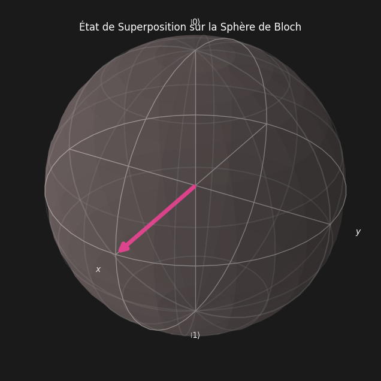
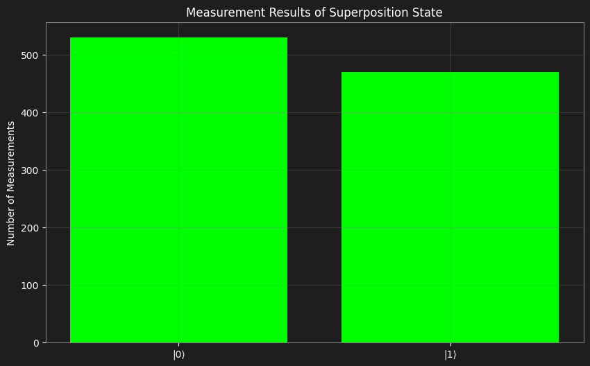
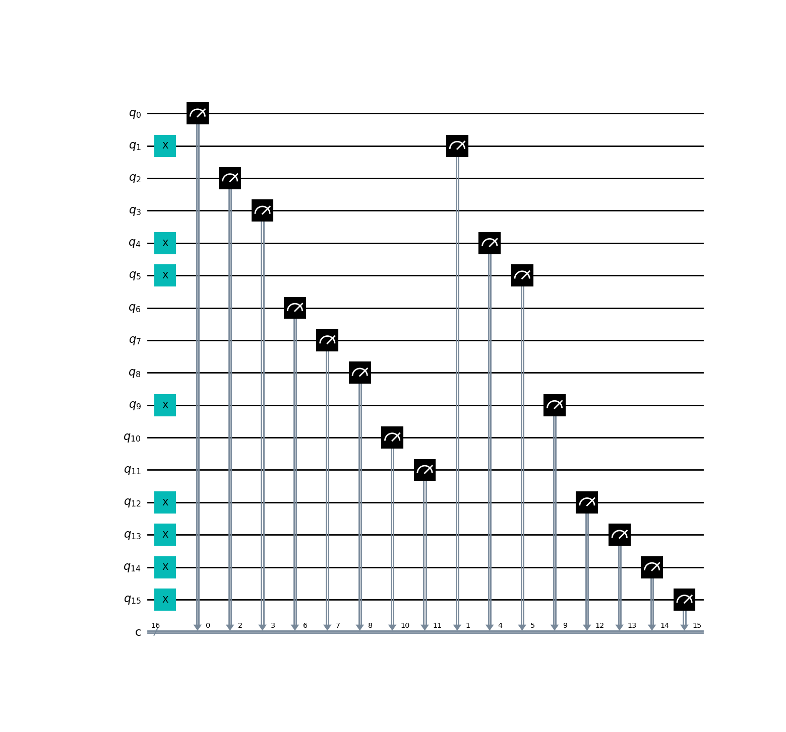
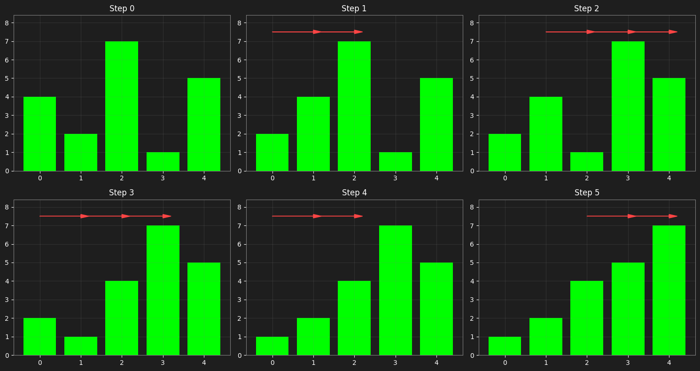
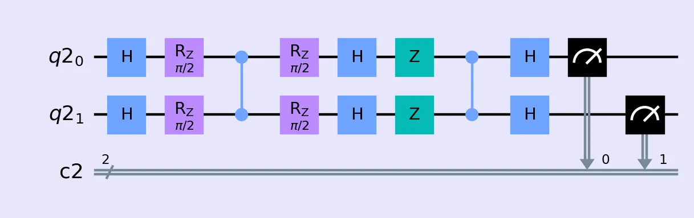

# Quantum Computing Implementations

A comprehensive exploration of quantum computing using IBM's Qiskit. This project demonstrates the implementation of fundamental quantum concepts and their practical applications

## 🧠 Logic and Fundamental Concepts

### Base Quantum Principles
1. **Superposition**: A qubit can be in state |0⟩, |1⟩, or a combination of both
2. **Measurement**: The act of measuring a qubit forces it to choose a definite state
3. **Quantum Gates**: Operations that manipulate quantum states
4. **Entanglement**: Correlation between qubits that enables parallel operations

## 🔬 Detailed Implementations

### 1. Quantum Superposition (quantum_superposition.py)



**Extract of Code :**
```python
def create_quantum_circuit() -> QuantumCircuit:
    qc = QuantumCircuit(1, 1)
    qc.h(0)  # Apply Hadamard gate for superposition
    qc.measure(0, 0)  # Measure the qubit
    return qc


def execute_circuit(qc: QuantumCircuit, shots: int = 1000) -> dict:
    backend = Aer.get_backend('qasm_simulator')
    job = execute(qc, backend, shots=shots)
    result = job.result()
    return result.get_counts(qc)
```

💻 The complete code is available here: [quantum_superposition.py](src/algorithms/quantum_superposition.py) 🔬

**Explanation:**

1. **Initial State**: |0⟩

2. **After Hadamard Gate**:
   |ψ⟩ = 1/√2(|0⟩ + |1⟩)

3. **Probabilities**:
   - P(|0⟩) = 50%
   - P(|1⟩) = 50%

4. **Measurements**:
   - Over 1000 measurements, we expect approximately 500 |0⟩ and 500 |1⟩
   - Error margin: ±3% (≈30 measurements)


### 2. Quantum text encoding (quantum_text_encoding.py)


**Extract of Code :**
```python
    # Create quantum and classical registers
    qr = QuantumRegister(n_qbits, 'q')
    cr = ClassicalRegister(n_qbits, 'c')
    qc = QuantumCircuit(qr, cr)

    # Encode binary data into quantum state
    for i, bit in enumerate(binary_chunk):
        if bit == '1':
            qc.x(qr[i])

    # Measure qbits
    qc.measure(qr, cr)
```

**Encoding Process:**
1. **ASCII**: Character → 8 bits
   ```
   H → 72 → 01001000
   i → 105 → 01101001
   ```

2. **Quantum**: Bit → Qubit
   ```
   0 → |0⟩
   1 → X|0⟩ = |1⟩
   ```


**Chunking Strategy**: Message → Chunks
   ```
   "Hello" → ["Hel", "lo"]
   ```
   This approach allows:
   - Processing messages of any length
   - Working within qubit limitations
   - Parallel processing of chunks

4. **Measurement**: Qubits → Classical bits
   ```
   |ψ₁⟩ → 01001000 (H)
   |ψ₂⟩ → 01101001 (i)
   ```

The chunking strategy was implemented to overcome hardware limitations on available qubits. By processing the text in smaller chunks (default size: 3 characters), we can:
- Handle messages of arbitrary length
- Stay within quantum hardware constraints
- Enable potential parallel processing of chunks
- Maintain quantum advantages for each chunk

Each chunk follows the full quantum encoding process independently, with results combined afterwards. This practical compromise allows us to leverage quantum properties while working within real-world limitations.


💻 The complete code is available here: [quantum_text_encoding.py](src/algorithms/quantum_text_encoding.py) 🔬


### 3. Quantum Sort (quantum_sort.py)


**Extract of Code :**
```python
def quantum_compare(a: int, b: int) -> bool:
    # Create circuit with 1 qubit and 1 classical bit
    qr = QuantumRegister(1, 'q')
    cr = ClassicalRegister(1, 'c')
    qc = QuantumCircuit(qr, cr)

    # Encode numbers (if a > b, apply X on qubit)
    if a > b:
        qc.x(qr[0])

    # Measure qubit into classical bit
    qc.measure(qr[0], cr[0])
```

**Explanation of the comparaison process:**
1. **Encoding**: |ψ⟩ = |a⟩|b⟩
2. **Comparison**: U|a⟩|b⟩ = |a⟩|a>b⟩
3. **Measurement**: M|ψ⟩ → {0,1}

💻 The complete code is available here: [quantum_sort.py](src/algorithms/quantum_sort.py) 🔬


### 4. Grover's Search Algorithm (quantum_grover.py)


**Extract of Code :**
```python
    # Apply Grover's algorithm
    # - The oracle (`create_oracle`) identifies the target state by inverting its phase
    # - The diffuser (`diffuser`) amplifies the amplitude of the marked state
    # - After ~√N iterations, the probability of measuring the target state is maximal
    for i in range(n_iterations):
        print(f"⚡ Iteration {i + 1}/{n_iterations}")
        qc.compose(create_oracle(n_qubits, target_index), inplace=True)
        qc.compose(diffuser(n_qubits), inplace=True)

    qc.measure(qr, cr)
```

**Explanation:**

1. **Initial State**:
   - After Hadamard gates: |ψ⟩ = 1/√N * (sum of all states)
   - N = 2ⁿ (where n = number of qubits)
   - Creates equal probability for all states

2. **Oracle Step**:
   - Marks target state by phase flip
   - Changes sign of target state from + to -
   - Other states remain unchanged

3. **Diffusion Step**:
   - Reflects amplitudes around average
   - Increases amplitude of target state
   - Decreases amplitude of other states

4. **Performance**:
   - Takes about π/4 * √N iterations
   - Success rate close to 100%
   - About √N times faster than classical search

💻 The complete code is available here: [quantum_grover.py](src/algorithms/quantum_grover.py) 🔬


## 🎯 Current State and Future Improvements

### Current Implementation Limitations

The current implementations have several important limitations to consider:

1. **Basic Usage of Quantum Paradigm**
   - The implemented algorithms don't fully leverage quantum computing potential
   - The absence of quantum entanglement significantly limits performance
   - Operations remain close to classical approaches, merely translated to quantum

2. **Intermediate Development Stage**
   - These implementations represent a transitional phase between:
     - Classical programming
     - True optimized quantum computing
   - They reflect the learning process and familiarization with quantum concepts

3. **Educational Value**
   - Despite their limitations, these projects enabled:
     - Understanding of core concepts
     - Mastery of basic tools (Qiskit)
     - Grasp of essential quantum principles

### Conclusion

These implementations represent an intermediate phase in my quantum computing learning journey. While they don't yet fully exploit the quantum paradigm, they provide a solid foundation for developing more sophisticated algorithms in the future. This progressive approach, although not harnessing the full power of quantum computing, has allowed me to build the fundamental understanding necessary to tackle more advanced implementations that will fully utilize quantum entanglement and parallelism. I am particularly pleased to have been able to develop and understand complex algorithms such as quantum sorting and text encoding, which have allowed me to put these advanced concepts into practice.


## 📊 Theoretical Performance Analysis

### Algorithmic Complexity
1. **Search**:
   - Classical: O(N)
   - Quantum: O(√N)

2. **Sorting**:
   - Comparisons: O(N²)
   - Quantum advantage in comparisons

3. **Encoding**:
   - Linear: O(N) bits → qubits
   - Parallelization possible

## 🚀 Getting Started

### Prerequisites
- Python
- Qiskit
- Matplotlib

### Installation
```bash
git clone https://github.com/DjeridiY/Quantum-Qiskit-Computing.git
cd quantum-computing
pip install -r requirements.txt
```

## 📚 Further Reading
- [Qiskit Documentation](https://qiskit.org/documentation/)
- [Quantum Computing Fundamentals](https://qiskit.org/textbook/ch-states/introduction.html)
- [Grover's Algorithm Details](https://qiskit.org/textbook/ch-algorithms/grover.html)

## 📝 License
This project is licensed under the MIT License - see the [LICENSE](LICENSE) file for details.
